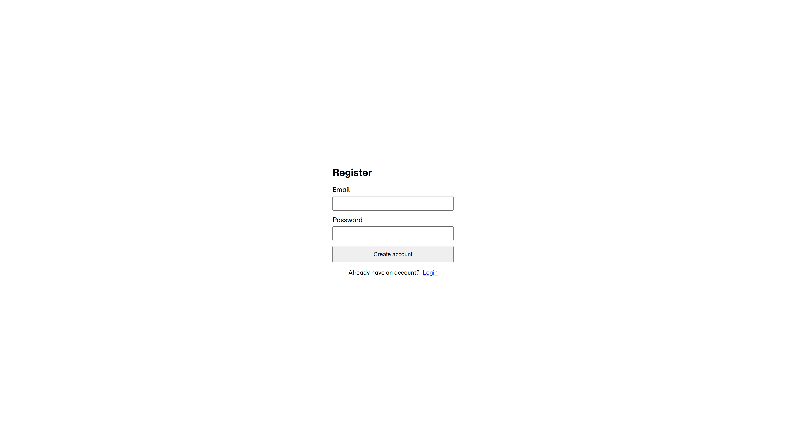
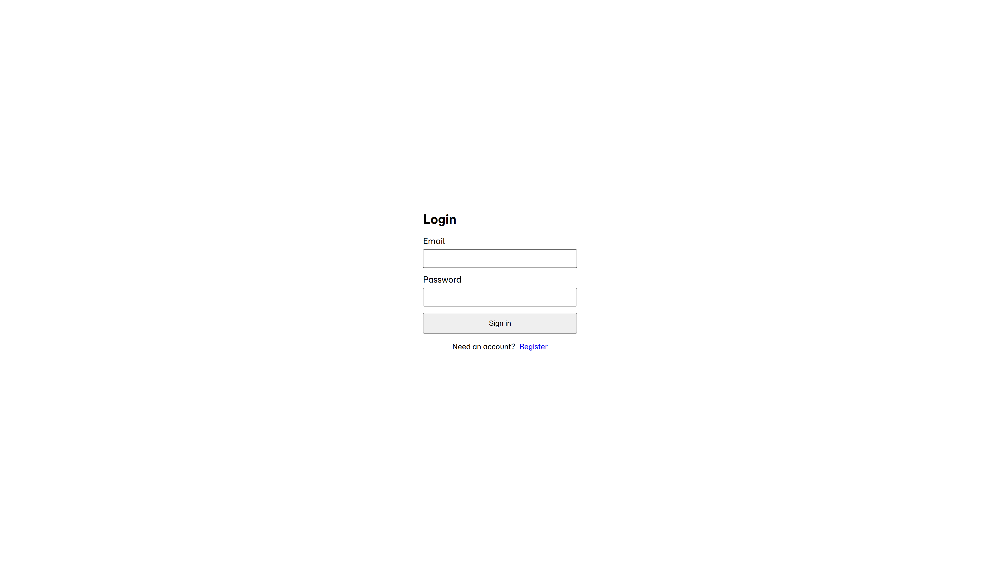

# Authentication Boilerplate

Full-stack starter kit for email and password authentication using a TypeScript Express API and a React client.





## Features

- Ready-made registration, login, and dashboard views with responsive styling.
- Session flow with JWT access tokens, HTTP-only refresh cookies, and token rotation.
- MongoDB user model with bcrypt hashed passwords and stored refresh token hashes.
- Client-side and server-side validation powered by Zod.
- Production-ready Express hardening with Helmet, strict CORS, and layered rate limiting.

## Tech Stack

- **Backend:** Node.js, Express 5, TypeScript, Mongoose, JWT, bcrypt.
- **Frontend:** React 19, Vite, React Router, Axios, Context API.
- **Tooling:** TypeScript project references, ESLint, concurrently for multi-app dev.

## Getting Started

### Prerequisites

- Node.js 18+ and npm.
- MongoDB instance (local `mongodb://localhost:27017` or Atlas connection string).

### 1. Configure environment variables

Copy the sample files and fill in the secrets that make sense for your setup.

```bash
backend/.env
frontend/.env
```

### 2. Install dependencies

From the repository root:

```bash
npm run install-all
```

This installs the root toolchain and the dependencies inside `backend/` and `frontend/`.

### 3. Run the application in development

```bash
npm run dev
```

- API runs on `http://localhost:5001`.
- Web app runs on `http://localhost:5173` and proxies API calls with credentials.

### 4. Build for production

```bash
npm run build
```

`backend/dist` contains the compiled server. `frontend/dist` holds static assets that can be served by the API or any static host.

## Security Practices

- **Rate limiting:** Global, login, and registration limits via `express-rate-limit`.
- **Transport hardening:** Helmet disables `x-powered-by`, enforces secure headers; JSON payload size limited to 10 KB.
- **Credential safety:** Passwords hashed with bcrypt; refresh tokens stored as SHA-256 hashes and tied to rotating `tokenId`s.
- **Session management:** Refresh tokens issued as HTTP-only cookies (`SameSite=Lax`) and cleared on logout or invalid refresh attempts.
- **Validation:** Zod schemas validate payloads on both client and server before hitting core logic.
- **CORS:** Allowlist-based origin configured through `CLIENT_ORIGIN` for cross-site protection.

## License

Released under the [MIT License](LICENSE).
